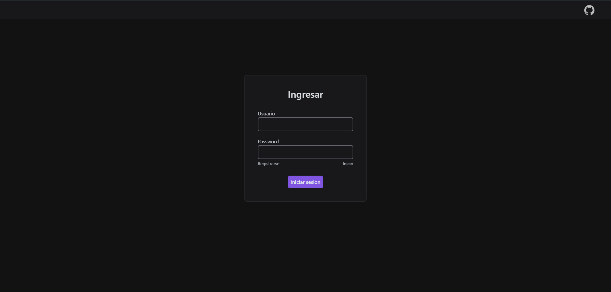

# Acortador de links

Para usar en la carpeta acortador de links ejecutar en la terminal:
**npm install** and **npm run dev**

Luego ir a la direccion de la carpeta api y ejecutar en la terminal node index.js:
**node index.js**

